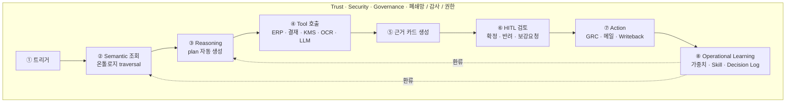

# AAP 프로토타입 작동 방식 — 지급결의 통제 운영평가

> **버전** v0.1 · **작성일** 2026-05-28 · **용도** 내부 보고 / 고객 시연(설득)용
> **참조 기획안** `공유용/aap_proactive_offering_v300_260527.html` (이하 v300)
> **벤치마크 도식** KSOX AI(내부통제 운영평가 자동화 솔루션, 삼일PwC 도메인 + AI 기술력 기반)

---

## 0. 이 문서가 하는 일

이 문서는 **두 가지 질문에 답하기 위해** 쓰여졌습니다.

1. **(내부 보고)** "v300 기획안의 AAP가 정말 구현 가능하고, 왜 지금이 적기인지"를 임원·유관부서에 한 번에 보일 수 있는가
2. **(고객 시연)** "RAG·RPA·기존 AI 솔루션과 무엇이 다른지"를 30분 미팅에서 손에 잡히게 보일 수 있는가

이를 위해 **K-SOX 내부통제 운영평가** 도메인의 **지급결의 통제 1건**을 끝까지 따라가며,
v300의 **AAP Execution Loop(① Data → ② Semantic → ③ Reasoning → ④ Action → ⑤ Learning)**가
실제로 어떻게 돌아가는지 단계별로 풀어냅니다.

벤치마크는 첨부된 **KSOX AI 도식**입니다 — 같은 도메인을 다루는 검증된 상용 솔루션이고,
AAP가 그 위에 어떤 층을 더하는지를 보이는 가장 좋은 거울입니다.

---

## 1. 한 줄 요약

> KSOX AI는 **"AI가 평가 보고서를 쓴다"**까지 갑니다.
> AAP는 거기에서 멈추지 않고 **"AI가 평가하고 → 사람과 함께 확정하고 → 시스템에 반영하고 → 다음 평가가 더 똑똑해지는 운영 루프"**를 닫습니다.
> 그 루프를 닫는 데 필요한 4가지 자산(**Semantic · Reasoning · HITL · Learning**)을 모두 갖춘 게 AAP이고, 그중 어느 하나라도 빠지면 다시 "PoC로 끝나는 AI"가 됩니다.

---

## 2. 문제 — 왜 KSOX AI 같은 솔루션만으로는 부족한가

### 2-1. KSOX AI 도식이 보여주는 것

첨부 이미지의 KSOX AI는 K-SOX(내부회계관리제도) 운영평가를 3단계로 자동화합니다.

| 단계 | KSOX AI가 하는 일 |
|---|---|
| **Step 1.** 모집단 데이터 추출 & 샘플링 | ERP 기반 통계 데이터 추출, Risk-based 샘플 자동 추출 |
| **Step 2.** 증빙 추출 & 온톨로지 구조화 | 증빙 문서 자동 매핑, 통제-리스크-모집단-증빙 관계의 온톨로지 구축 |
| **Step 3.** AI 기반 운영평가 수행 | 온톨로지 연결 데이터 기반 AI 운영평가, 미비점 탐지, LLM 평가 보고서 작성 |

훌륭한 솔루션입니다. 그러나 **고객사 입장에서 보면** 평가 보고서가 만들어진 뒤에도
여전히 사람이 해야 할 일이 많이 남습니다.

### 2-2. 그래서 평가 보고서가 나온 다음 무슨 일이 일어나는가

```
[KSOX AI 평가 보고서 출력] ── 여기까지 자동화 ──┐
                                                  │
   ▽ 여기서부터는 다시 사람의 손으로                ▽
                                              ┌──────────────────────────┐
                                              │ 감사인 검토              │
                                              │ → 미비 후보 채택/반려     │
                                              │ → 근거 보강 위해 ERP 재조회│
                                              │ → GRC 시스템에 개선과제 발급│
                                              │ → 담당자 메일로 통보       │
                                              │ → 다음 분기 평가 계획 수립 │
                                              └──────────────────────────┘
```

이게 v300 1장에서 "**AI 결과와 실제 처리 흐름의 단절**"이라고 부른 그 갭입니다.
그리고 v300 1장의 "**판단·승인 이력이 운영 자산으로 쌓이지 않는다**"가 그 다음 갭입니다.

### 2-3. 결과적으로 고객에게 남는 4가지 갭

| # | 갭 | 구체적인 증상 |
|---|---|---|
| **G1** | **실행 갭** | 평가서가 PDF로 끝나고, GRC·결재·메일 시스템에 자동 반영 안 됨 |
| **G2** | **검토 갭** | 미비 후보의 근거 카드(증빙·규정·과거 이력)가 한 화면에 안 모임 → 감사인이 ERP를 다시 열어 봐야 함 |
| **G3** | **권한·통제 갭** | LLM이 만든 판단을 "어느 등급은 자동 확정, 어느 등급은 반드시 사람" 하는 규칙이 모호 |
| **G4** | **학습 갭** | 같은 부서·같은 계정 조합에서 반복되는 미비 패턴이 다음 분기 샘플링 가중치로 이어지지 않음 |

**AAP는 이 4개를 메우러 들어가는 층**입니다. KSOX AI를 대체하는 게 아니라, KSOX AI 같은 솔루션을 안에 품고 그 바깥을 닫습니다.

---

## 3. AAP는 무엇을 다르게 하는가 — 한 페이지 비교

| 능력 | 단순 RAG | RPA | KSOX AI (도식 기준) | **AAP 프로토타입** |
|---|:--:|:--:|:--:|:--:|
| 규정·매뉴얼 검색 | ✅ | ✗ | △ | ✅ |
| 룰 기반 자동화 (사전정의) | ✗ | ✅ | △ | ✅ |
| **온톨로지 기반 의미 이해** | ✗ | ✗ | ✅ | ✅ |
| **목표 해석 → 다단계 계획 수립** | ✗ | ✗ | ✗ | ✅ |
| **도구(ERP/결재/KMS) 호출 분기** | ✗ | △ 사전정의만 | △ | ✅ |
| **HITL 근거 카드** (한 화면에 증빙+규정+과거이력) | ✗ | ✗ | △ 보고서 | ✅ |
| **시스템 Writeback** (GRC 발급, 결재 회신) | ✗ | ✅ 룰 한정 | ✗ | ✅ |
| **운영 학습** (위험가중치 자동 갱신) | ✗ | ✗ | ✗ | ✅ |
| 감사 가능한 Decision Log | ✗ | △ | △ | ✅ |
| 통제 정의 변경 시 재개발 비용 | — | **높음** | 중간 | **낮음** (온톨로지 수정만) |

핵심 메시지 한 줄:
> **"RAG는 검색, RPA는 자동화, KSOX AI는 평가서 — AAP는 *판단·실행·학습이 끝까지 닫히는 운영 루프*"**

---

## 4. 시나리오 — "Q1 지급결의 통제 평가" 8단계 워크스루

**상황 설정**
한 금융지주의 감사팀은 분기마다 K-SOX 통제 운영평가를 합니다. 그중 하나가
**"5천만 원 초과 지급결의 시 분리원칙·승인권한·증빙구비"** 통제입니다. 분기마다
약 1,200건의 모집단에서 50건을 샘플링, 각 건의 ERP 거래 + 결재 이력 + 첨부 증빙을
일일이 대조합니다. 지금까지는 사람 3명이 2주 일했습니다.

아래 8단계가 AAP에서 어떻게 흐르는지 그 단계마다 **(a) 무슨 일이 일어나는지, (b) 화면에 뭐가 보이는지, (c) RAG·RPA·KSOX AI라면 어땠을지, (d) AAP만이 가능한 이유**를 보입니다.

### 단계 ① — 트리거: 감사인이 "Q1 지급결의 평가 시작" 클릭

**무슨 일이 일어나는가**
감사 팀장이 워크스페이스에서 "지급결의 통제(C-FIN-007) · Q1 평가 시작" 버튼을 누릅니다.

**화면**
```
┌─────────────────────────────────────────────────────────────┐
│ Q1 통제 평가 대시보드                                       │
│                                                             │
│ ▷ C-FIN-007  지급결의 분리원칙 통제      [평가 시작]        │
│ ▷ C-FIN-008  여신 한도 통제              [평가 시작]        │
│ ▷ C-OPS-021  IT 변경 통제                [평가 시작]        │
└─────────────────────────────────────────────────────────────┘
```

**기존 방식이라면**
- RAG: 통제 정의를 검색해서 보여주기는 하지만 "평가 시작"이라는 행위 자체가 없습니다.
- RPA: 미리 정의된 룰대로 모집단을 뽑긴 합니다. 다만 위험기반 샘플링 가중치 변경, 통제 정의 변경 시마다 룰을 다시 짭니다.
- KSOX AI: 트리거는 됩니다. 다만 그 뒤가 "보고서 출력"으로 직선입니다.

**AAP만이 가능한 이유**
이 한 번의 클릭이 **Orchestrator에 목표를 전달**합니다. Orchestrator는 다음 단계에서 보듯이
온톨로지를 읽고 *스스로* 평가 계획을 짜는 주체입니다.

---

### 단계 ② — Semantic 조회: 온톨로지에서 통제 정의·증빙·평가규칙 인출

**무슨 일이 일어나는가**
Orchestrator는 온톨로지에 `C-FIN-007` 노드를 조회합니다. 거기엔 다음이 연결되어 있습니다.

- 적용 회계 계정: `11x` 지급계정 7개
- 위험 분류: 권한 남용, 분리원칙 위배, 증빙 위조
- 평가 증빙 타입: 영수증, 인보이스, 결재 이력
- 승인 권한 매트릭스: 금액 구간별 1차/2차 결재자
- 정책 인용: 사내 회계 규정 §12, K-SOX 가이드 4.3
- 예외 기준: 긴급 지급 시 사후 결재 허용 (24시간 이내 보완 증빙)
- 과거 미비 패턴: 자회사 K의 11801 계정에서 3분기 연속 권한 위반

**화면**
```
┌───────────────────────────────────────────────────────────────────┐
│  온톨로지 뷰  ─ Agent가 지금 보고 있는 통제 의미                  │
│                                                                   │
│           ┌──────────────────────┐                                │
│           │ C-FIN-007            │                                │
│           │ 지급결의 분리원칙 통제 │ ◄─ Agent 시선 (하이라이트)   │
│           └──────────────────────┘                                │
│             │     │     │      │                                  │
│        적용 │ 위험│ 증빙 │ 권한 │ 예외 │ 정책 │ 과거이력          │
│             ▼     ▼     ▼      ▼                                  │
│         [11x계정][분리원칙위배][영수증·인보이스][결재매트릭스] ...│
└───────────────────────────────────────────────────────────────────┘
```

**기존 방식이라면**
- RAG: 통제 정의 문서를 검색해서 텍스트로 보여줍니다. 다만 "이 통제가 어느 계정에 적용되는지 → 그 계정의 모집단을 뽑아라"는 *추론 연결*은 못 합니다.
- RPA: 통제 정의가 코드로 박혀 있습니다. 새 통제를 추가하려면 룰을 새로 짭니다.
- KSOX AI: 같은 형태의 온톨로지를 갖고 있습니다 (그래서 KSOX AI는 RAG/RPA보다 앞섭니다).

**AAP만이 가능한 이유**
온톨로지가 *읽고 끝나는 메타데이터*가 아니라 **Reasoning의 입력**입니다. 다음 단계에서
Agent는 이 온톨로지를 보고 *스스로 평가 계획을 작성*합니다.

---

### 단계 ③ — Reasoning: Agent가 평가 계획을 짠다

**무슨 일이 일어나는가**
Orchestrator는 Claude(또는 사내 LLM)에게 **온톨로지 정의 + 평가 목표**를 컨텍스트로 넘기고
"이 통제를 평가하기 위한 단계를 짜라"고 시킵니다. 결과:

```
Agent's Plan (자동 생성)
  1. SAP ERP에서 Q1 동안 11x 계정 거래 중 5천만원 초과 건 모집단 추출
  2. 위험 가중치 적용 (자회사 K, 11801 계정에 가중치 1.5배 — 과거이력 반영)
  3. 모집단에서 50건 위험기반 샘플링
  4. 각 샘플마다 병렬 처리:
     4-1. 결재 시스템에서 결재 이력 조회
     4-2. KMS에서 첨부 증빙(영수증·인보이스) 조회
     4-3. LLM으로 증빙·금액·승인자 권한 일치 여부 평가
     4-4. 예외 기준(긴급지급 24시간 보완) 적용
  5. 미비 후보 도출 (점수 임계치 이상)
  6. 미비 후보를 HITL 워크스페이스로 라우팅
```

**화면**
```
┌─────────────────────────────────────────────────────────────┐
│  Agent 실행 로그                                            │
│                                                             │
│  [10:21:03] 통제 C-FIN-007 정의 조회 완료                   │
│  [10:21:04] 위험 가중치 산출: 11801 계정 ×1.5 (사유: 과거 3분기 미비) │
│  [10:21:06] SAP /erp/transactions?account=11x&amt>5e7 호출  │
│  [10:21:08] 모집단 1,247건 수신                             │
│  [10:21:09] 위험기반 샘플링: 50건 선정                      │
│  [10:21:10] 샘플별 증빙 수집 시작 (병렬 10 worker)          │
│  ...                                                        │
└─────────────────────────────────────────────────────────────┘
```

**기존 방식이라면**
- RAG: 검색만 합니다. 다단계 계획을 짜지 못합니다.
- RPA: 사람이 짜둔 시나리오를 그대로 실행할 뿐, *온톨로지를 보고 그때그때 계획을 생성*하지 못합니다.
- KSOX AI: 이미 정의된 평가 파이프라인을 실행합니다. 새 통제가 추가되면 파이프라인을 다시 정의해야 합니다.

**AAP만이 가능한 이유 — 이게 가장 중요한 차별점**
Agent가 **온톨로지를 컨텍스트로 받아 매 평가마다 plan을 다시 짭니다.**
새 통제를 추가하려면 **온톨로지 노드 하나만 추가**하면 됩니다. 코드 변경 0.
이게 v300의 "**Skill·Template 재사용**"과 "**판단 자동화 흐름 설계**"가 의미하는 바입니다.

---

### 단계 ④ — Tool Use: Agent가 실제 시스템들을 호출

**무슨 일이 일어나는가**
Agent는 plan대로 다음 도구들을 호출합니다.

- `SAP_ERP.get_transactions(account, period, threshold)` → 모집단 1,247건
- `Approval.get_workflow(transaction_id)` → 각 건의 결재 이력
- `KMS.get_attachments(transaction_id)` → 영수증·인보이스 PDF
- `OCR.extract(pdf)` → 증빙에서 금액·일시·공급자명 추출
- `LLM.evaluate(transaction, evidence, control_def)` → 분리원칙·권한 일치 자연어 판단

**화면**
```
┌──────────────────────────────────────────────────────────────────┐
│  Tool Call Trace  (각 호출의 입력·출력·소요시간이 펼쳐짐)        │
│                                                                  │
│  ◢ SAP_ERP.get_transactions  ················  1247건 / 1.2초    │
│    └ account: 11x, period: 2026-Q1, amount>50000000              │
│  ◢ Approval.get_workflow(×50)  ···············  50건 / 4.8초     │
│  ◢ KMS.get_attachments(×50)    ···············  127개 / 6.2초    │
│  ◢ OCR.extract(×127)            ···············  127개 / 18.4초   │
│  ◢ LLM.evaluate(×50)            ···············  50건 / 32.1초   │
│      └ Sonnet 4.6 · 평균 토큰: 입력 3,200 / 출력 540              │
└──────────────────────────────────────────────────────────────────┘
```

**기존 방식이라면**
- RAG: 도구 호출 개념이 없습니다.
- RPA: 사전 정의된 시나리오대로만 호출, 분기 안 됩니다 (특정 건이 OCR 실패하면 전체 중단).
- KSOX AI: 호출은 합니다. 다만 분기 처리는 제한적이고, 외부 추가 시스템(예: 사내 메일 통보)으로의 확장은 별도 통합 필요.

**AAP만이 가능한 이유**
**Agent가 호출 결과를 보고 plan을 *동적으로 조정*합니다.** 예시:
- OCR 신뢰도가 낮으면 Agent가 *스스로* "원본 PDF 보기" 도구를 추가 호출
- 한 건의 결재 이력이 비정상이면 Agent가 *스스로* 결재자의 권한 매트릭스를 재조회
- 50건 중 5건이 OCR 실패해도 나머지 45건 평가는 계속 진행

이게 LangGraph·tool use 등으로 구현되는 **Agentic Reasoning의 본질**입니다.

---

### 단계 ⑤ — 미비 후보 도출 + 근거 카드 생성

**무슨 일이 일어나는가**
50건 중 LLM이 *위반 의심 점수 0.75 이상*으로 판정한 후보 5건이 나옵니다.
Agent는 각 후보마다 **근거 카드**를 자동 생성합니다.

근거 카드 1장에 들어가는 것:
- 거래 정보 (계정·금액·일시·당사자)
- 적용 통제 (C-FIN-007 + 인용 정책 §12)
- 증빙 (영수증 썸네일 + 인보이스 + 결재 이력)
- LLM의 판단 근거 (자연어 한 단락)
- 위반 유형 분류 (분리원칙 위배 / 권한 초과 / 증빙 미비)
- 신뢰도 (0.0~1.0)
- 과거 유사 사례 (있다면)
- 권장 조치 (자동 ↔ HITL ↔ 보류)

**화면**
```
┌─────────────────────────────────────────────────────────────┐
│  미비 후보 #3 / 5                          신뢰도 0.87 ⚠️    │
├─────────────────────────────────────────────────────────────┤
│  거래: 2026-01-17  72,500,000원  자회사 K · 11801          │
│  당사자: 김XX 차장 (요청) → 김XX 차장 (1차결재)             │
│                                                             │
│  ⚠️ 분리원칙 위배 의심                                       │
│     요청자와 1차 결재자가 동일 인물 (사내 회계 규정 §12-3 위반) │
│                                                             │
│  [증빙 보기] [원천 거래 보기] [과거 유사 사례 3건]          │
│                                                             │
│  Agent 권장:  ▣ HITL 검토 필요 (자동 확정 아님)             │
│              ─────────────────                              │
│              ▢ 확정  ▢ 반려  ▢ 추가 증빙 요청                │
└─────────────────────────────────────────────────────────────┘
```

**기존 방식이라면**
- RAG: 증빙 검색은 가능. 다만 "왜 위반인지" 한 단락 자연어 + 정책 §12-3 정확한 인용 + 과거 사례 + 권장 조치를 *동시에 한 카드로* 만들지 못합니다.
- RPA: 룰 위반은 잡지만, 근거를 자연어로 설명하지 못합니다 ("PASS / FAIL"만).
- KSOX AI: 평가 보고서 안에 비슷한 내용이 들어갑니다. 다만 그건 PDF의 한 행으로 들어가지, *클릭 가능한 검토 워크스페이스 카드*가 아닙니다.

**AAP만이 가능한 이유**
"**근거 카드**"는 LLM의 자연어 능력 + 온톨로지의 의미 연결 + Tool use의 증빙 첨부가
한 화면에서 합쳐져야 가능합니다. 그래서 v300이 **HITL Workspace**를 핵심 capability로 둔 것입니다.

---

### 단계 ⑥ — HITL: 감사인의 검토와 확정

**무슨 일이 일어나는가**
감사인은 워크스페이스에서 5건의 근거 카드를 한 카드씩 검토합니다.

- 3건은 **확정** (분명한 위반)
- 1건은 **추가 증빙 요청** → Agent가 백그라운드로 다시 KMS 조회
- 1건은 **반려** (긴급지급 예외 조항 적용 — Agent가 놓친 부분)

감사인이 반려를 누르면 Agent에게 **사유 입력 박스**가 뜹니다.
"긴급지급 24시간 이내 보완 증빙 있음, 예외 조항 §12-5 적용"
이 한 줄이 다음 단계 학습으로 흘러갑니다.

**화면**
```
┌─────────────────────────────────────────────────────────────┐
│  HITL Workspace  ─ 미비 후보 검토                            │
│                                                             │
│  진행 [▓▓▓▓░░░░░░] 3/5                                      │
│                                                             │
│  ▷ #1  확정  (분리원칙 위배)                                 │
│  ▷ #2  확정  (권한 초과)                                     │
│  ▷ #3  ▣ 현재 카드 보는 중                                   │
│  ▷ #4  대기                                                  │
│  ▷ #5  대기                                                  │
└─────────────────────────────────────────────────────────────┘
```

**기존 방식이라면**
- RAG: HITL 개념 없음.
- RPA: 사람 검토 단계는 있지만 "왜 그렇게 판정했는지"의 근거를 사람이 다시 찾아야 함.
- KSOX AI: 평가 보고서를 사람이 검토할 수는 있지만 "이 항목 반려, 사유 입력" → "다음 평가 모델에 반영" 까지는 별도 GRC 도구 필요.

**AAP만이 가능한 이유**
**HITL 결정이 시스템 안에서 캡처되고 다음 단계로 흐릅니다.**
v300 4-2 Capability Map의 "**Review / Approval Workspace**"가 정확히 이 역할입니다.

---

### 단계 ⑦ — Action: 시스템 Writeback

**무슨 일이 일어나는가**
감사인이 4건을 확정 처리하자, Agent가 자동으로:

1. GRC 시스템에 **개선과제 4건 발급** (`GRC.create_action_item(...)`)
2. 각 미비점의 책임자(부서장)에게 **메일 통보** (`Mail.send(...)`)
3. 결재 시스템에 **재결재 회신** (해당 거래는 사후 보완 결재 필요) (`Approval.return_for_revision(...)`)
4. 감사 보고서 초안 PDF 생성 + 워크스페이스에 첨부

**화면**
```
┌─────────────────────────────────────────────────────────────┐
│  Action 실행 결과                                            │
│                                                             │
│  ✓ GRC 개선과제 4건 발급                                     │
│       └ GRC-2026Q1-FIN-001 ~ 004                            │
│  ✓ 책임자 메일 통보 4건 (수신: 부서장 4명)                   │
│  ✓ 결재 회신 4건 (사후 보완 결재 요청)                       │
│  ✓ 감사 보고서 초안 PDF 생성 [다운로드]                      │
│                                                             │
│  모든 처리가 Decision Log에 기록되었습니다.  [로그 보기]    │
└─────────────────────────────────────────────────────────────┘
```

**기존 방식이라면**
- RAG: 외부 시스템 쓰기 권한 없음.
- RPA: 이 부분이 RPA의 강점. 다만 "어느 건은 GRC, 어느 건은 결재 회신, 어느 건은 메일만"의 분기를 매번 사람이 시나리오에 박아야 함.
- KSOX AI: 평가 보고서 → 외부 GRC로 export는 가능. 다만 **분기 룰이 온톨로지 안에 들어있고 Agent가 자동 분기하는 구조**는 아님.

**AAP만이 가능한 이유**
"미비 유형별 후속 조치"가 **온톨로지의 한 속성**입니다. Agent가 온톨로지를 읽고 자동 분기합니다.
새 조치 유형을 추가하려면 온톨로지에 노드 추가만 하면 됩니다.

---

### 단계 ⑧ — Operational Learning: 다음 평가가 더 똑똑해진다

**무슨 일이 일어나는가**
모든 처리가 끝나면 Agent는 **학습 환류**를 합니다.

- **위험 가중치 갱신**: 자회사 K · 11801 계정에서 또 미비 → 가중치 ×1.5 → ×1.75
- **예외 패턴 캡처**: 단계 ⑥에서 반려된 #5 사례 → "긴급지급 24시간 보완" 패턴을 Skill로 저장
- **새 미비 패턴 발견**: 5건 중 3건이 "1차결재자 = 요청자" → **자동화 가능 통제 후보**로 마킹 (다음 분기엔 그 패턴은 LLM 없이 룰로 잡으면 됨, 더 빠르고 저렴)
- **Decision Log 적재**: 모든 step의 입력·도구호출·LLM 판단·HITL 결정이 불변 로그로 저장

**화면**
```
┌─────────────────────────────────────────────────────────────┐
│  Operational Learning ─ 다음 평가에 반영될 변경사항          │
│                                                             │
│  · 위험가중치 갱신                                           │
│      자회사 K / 11801   1.5 → 1.75                          │
│  · 새 Skill 등록                                             │
│      "긴급지급 24시간 보완 증빙" 예외 처리 패턴              │
│  · 자동화 후보 통제 발견                                     │
│      "1차결재자 ≠ 요청자" 룰 → LLM 없이 처리 가능 (×1/10 비용)│
│  · Decision Log 적재 완료  (이번 평가 총 1,247 row)         │
└─────────────────────────────────────────────────────────────┘
```

**기존 방식이라면**
- RAG / RPA / KSOX AI: 이 단계가 **거의 모두 결여**되어 있습니다. 평가는 끝나지만 *다음 평가가 더 똑똑해지는 메커니즘*은 사람의 머리 속에만 존재합니다. v300 1장의 "**운영 학습 자산화 부재**"입니다.

**AAP만이 가능한 이유**
이 단계가 **v300 Architecture의 ★ Operational Learning**이고, 이 단계가 빠지면 AAP가 아닙니다.
바로 이 환류가 PoC → 운영자산화 → 사업화로 이어지는 트랙입니다.

---

## 5. 8단계를 한 장으로 본 플로우 차트

```
┌────────────────────────────────────────────────────────────────────────┐
│                                                                        │
│  ① 트리거       ② Semantic 조회    ③ Reasoning 계획   ④ Tool 호출     │
│   감사인 →    Orchestrator →    Agent plan 자동 →    SAP·결재·KMS·     │
│   "평가시작"   온톨로지 traversal  생성              OCR·LLM 분기 호출  │
│                                                                        │
│                              ▼                                         │
│                                                                        │
│  ⑤ 근거카드 생성  ⑥ HITL 검토       ⑦ Action 실행      ⑧ Learning     │
│  미비후보 + LLM   감사인 →         GRC·메일·결재 →    위험가중치·      │
│  자연어 근거 +   확정/반려/추가     Writeback 자동분기  Skill·자동화후보 │
│  과거이력 카드   증빙요청                              + Decision Log   │
│                                                                        │
│                              ▼                                         │
│                                                                        │
│  ┌─────────────────────────────────────────────────────────────────┐  │
│  │ Operational Learning → ②/③ 환류 → 다음 평가 더 똑똑해짐          │  │
│  └─────────────────────────────────────────────────────────────────┘  │
│                                                                        │
└────────────────────────────────────────────────────────────────────────┘
        ▲                                                       ▼
   (Trust · Security · Governance가 8단계 전체를 감쌈)
   IAM · 권한 · 감사 · HITL · Guardrails · 폐쇄망 LLM
```

### Mermaid 버전 (문서·슬라이드 삽입용)



---

## 6. 온톨로지 — 추상적 단어 말고 실제 그림

v300이 "Business Semantic Modeling"이라고 부르는 것이 실제로 어떤 모습인지,
지급결의 통제 한 건만 그려보면 다음과 같습니다.

```
                           ╔═══════════════════════╗
                           ║   C-FIN-007           ║
                           ║   지급결의 분리원칙 통제 ║
                           ╚═══════════╤═══════════╝
                                       │
        ┌──────────────────────────────┼──────────────────────────────┐
        │             │           │    │     │            │             │
   적용 계정       위험 분류    평가 증빙  승인 권한    정책 인용    예외 기준
        │             │           │          │            │             │
   ┌────┴────┐   ┌────┴────┐  ┌──┴──┐   ┌────┴───┐   ┌────┴───┐    ┌────┴───┐
   │ 11800   │   │ 권한남용 │  │영수증│   │1차결재 │   │회계규정 │    │긴급지급│
   │ 11801   │   │ 분리원칙 │  │인보이스│ │ 매트릭스│   │ §12    │    │ 24h    │
   │ 11802   │   │  위배    │  │결재이력│ │        │   │K-SOX   │    │ 보완   │
   │  ...    │   │ 증빙위조 │  │공급자명│ │        │   │ 4.3    │    │        │
   └────┬────┘   └─────────┘  └─────┘   └────────┘   └────────┘    └────────┘
        │
        │ 과거 미비 패턴
        ▼
   ┌──────────────────────┐
   │ 자회사 K · 11801     │
   │ 3분기 연속 권한위반   │
   │ 위험가중치 ×1.5      │
   └──────────────────────┘
```

**노드 종류** (지급결의 통제 1건에 약 30~40개)
- Control · Risk · Account · EvidenceType · ApproverMatrix · PolicyClause · Exception · IncidentHistory · ActionType · DepartmentScope

**엣지 종류** (방향성 있음)
- `appliesTo` · `mitigates` · `requiresEvidence` · `requiresApproval` · `citesPolicy` · `exceptionAllowedBy` · `historicalGapIn` · `triggersAction`

**Agent가 이걸 어떻게 쓰는가**
- `MATCH (c:Control {id:"C-FIN-007"})-[:appliesTo]->(a:Account)` → 모집단 쿼리 조건
- `MATCH (c)-[:requiresEvidence]->(e:EvidenceType)` → KMS에서 무엇을 가져올지
- `MATCH (c)-[:historicalGapIn]->(p:Pattern)` → 위험 가중치 조정
- `MATCH (c)-[:exceptionAllowedBy]->(x:Exception)` → LLM 평가 시 컨텍스트

**왜 이게 차별점인가**
KSOX AI도 이 그래프를 갖고 있을 가능성이 높습니다. 다만 그 그래프가 **평가 *시점*에만 쓰이고
사후 학습으로 그래프가 *진화*하는 메커니즘**은 본 적이 없습니다. AAP는 단계 ⑧에서 본 것처럼
가중치·예외·자동화후보 노드가 자동 갱신됩니다.

---

## 7. 아키텍처 — v300 통합 아키텍처에 매핑

지금까지 본 8단계가 v300 4-1 통합 아키텍처의 어디에 들어가는지 정확히 매핑합니다.

```
┌─────────────────────────────────────────────────────────────────────┐
│ TRUST · SECURITY · GOVERNANCE                                       │
│ IAM · 권한 · 감사 · HITL · Guardrails · 폐쇄망 LLM                  │
│ ┌─────────────────────────────────────────────────────────────────┐ │
│ │ SERVICE LAYER · 감사인 워크스페이스                              │ │
│ │   ① 트리거       ⑤ 근거카드      ⑥ HITL       ⑦ Action 결과     │ │
│ └─────────────────────────────────────────────────────────────────┘ │
│           ▲                                              ▼          │
│ ┌─────────────────────────────────────────────────────────────────┐ │
│ │ AAP EXECUTION LOOP                                              │ │
│ │                                                                 │ │
│ │   Enterprise Data & Inputs                                      │ │
│ │     ↑ ERP 데이터 / 증빙 / 결재 / KMS                            │ │
│ │                                                                 │ │
│ │   ★ Business Semantic Modeling  ←─── 단계 ②                    │ │
│ │     통제·리스크·증빙·권한·정책 온톨로지                          │ │
│ │                                                                 │ │
│ │   Agentic Reasoning             ←─── 단계 ③④                   │ │
│ │     planner + tool router + LLM 평가                            │ │
│ │                                                                 │ │
│ │   Enterprise Integration & Action  ←─── 단계 ⑦                  │ │
│ │     GRC · 메일 · 결재 Writeback                                 │ │
│ │                                                                 │ │
│ │   ★ Operational Learning        ←─── 단계 ⑧                    │ │
│ │     Decision Log · 위험가중치 · Skill · 자동화후보              │ │
│ │     ─── 환류 → Semantic / Reasoning                             │ │
│ └─────────────────────────────────────────────────────────────────┘ │
│           ▲                                              ▼          │
│ ┌─────────────────────────────────────────────────────────────────┐ │
│ │ CUSTOMER ENVIRONMENT                                            │ │
│ │ SAP ERP · 결재시스템 · GRC · 증빙 저장소 · 메일·그룹웨어         │ │
│ └─────────────────────────────────────────────────────────────────┘ │
└─────────────────────────────────────────────────────────────────────┘
```

**8단계 → v300 5개 영역 매핑 표**

| 8단계 | v300 영역 |
|---|---|
| ① 트리거 | Service Experience |
| ② Semantic 조회 | ★ Business Semantic Modeling |
| ③ Reasoning 계획 | Agentic Reasoning |
| ④ Tool 호출 | Enterprise Data & Inputs + Agentic Reasoning |
| ⑤ 근거 카드 | Service Experience + Agentic Reasoning |
| ⑥ HITL | Service Experience (Review/Approval Workspace) |
| ⑦ Action | Enterprise Integration & Action |
| ⑧ Learning | ★ Operational Learning |
| (전체를 감쌈) | Trust · Security · Governance |

**즉 8단계 시연 하나로 v300 아키텍처 전부가 한 번에 보입니다.**
내부 보고에서도, 고객 시연에서도 — "그림에서 본 그 5개 영역이 *실제로* 이렇게 돈다"가 됩니다.

---

## 8. 왜 실현 가능한가 — 기술 스택 매핑 (Build · Buy · Borrow)

v300 별첨 A의 Build / Buy / Borrow 원칙을 그대로 적용합니다.

| 구성요소 | 전략 | 근거 |
|---|---|---|
| **Business Semantic (통제 온톨로지)** | **Build** | v300 4-2의 ★ 핵심 자산. KT DS IP화 대상 |
| **Agentic Orchestrator** (planner + tool router) | **Build + Borrow** | LangGraph / OpenAI Agents SDK 위에 통제·HITL 분기 자체 구현 |
| **HITL Workspace + Decision Log** | **Build** | 시연의 시각적 차별점. v300 4-2의 Review/Approval Workspace |
| **LLM 호출 + Guardrails** | **Buy (KT DS 자산)** | 자사 LLM Gateway, 폐쇄망 호환 강조 |
| **Ontology Store** | **Borrow** | Neo4j / RDF 무관. 데모는 JSON + Cytoscape.js로 충분 |
| **ERP/결재 Connector** | **Borrow** | MCP · n8n · 기존 RPA 자산. 데모는 Mock REST API |
| **OCR · Document Intelligence** | **Borrow** | Azure Document Intelligence 등 검증 자산 |
| **Evidence Storage** | **Borrow / Customer Asset** | 고객 KMS · MinIO · S3 |

**핵심 메시지**
- 모든 걸 Build하는 게 아니라 **Build·Buy·Borrow 조합**이라는 점.
- KT DS IP는 **Semantic + HITL + Decision Log + Orchestration 통제 로직**에 집중.
- 나머지는 검증된 외부 자산을 묶어 쓰면 됨 — *그래서* 2~3주 안에 PoC 가능.

**기술 검증 포인트** (내부 보고용)
- LangGraph + Claude tool use는 이미 안정 — 자체 작성한 도구·prompt 캐싱·HITL 분기 패턴이 production-ready 수준
- Cytoscape.js 그래프 시각화 — 50~200개 노드까지 부담 없음
- 폐쇄망 LLM은 KT DS 사내 GW가 이미 운영 중
- Mock SAP/결재 API는 FastAPI 1~2일 작업

---

## 9. 데모 산출물 — 1.5~3주 마일스톤

| 마일스톤 | 기간 | 산출물 | 시연 가능 범위 |
|---|---|---|---|
| **M1** | 3~5일 | HTML 셸 + 온톨로지 시각화 + Mock 데이터 + 스크립트된 8단계 시퀀스 | 단계 ①~⑧ 전체 (LLM 없이, 클릭 진행) |
| **M2** | +3~5일 | Claude API 연동 — 근거 카드 자연어 생성·증빙 평가 실제 호출 | 단계 ⑤·④ 일부가 실시간 LLM으로 |
| **M3** | +5~10일 | Mock SAP/결재 API + Claude tool use + Decision Log 적재 | 단계 ④·⑦·⑧이 진짜 동작하는 PoC |

**M1만으로도 내부 보고 + 1차 고객 시연 가능.**
**M2까지 가면 "AI가 실시간으로 판단하는 장면"이 생겨서 시연 임팩트 +50%.**
**M3는 기술 심사가 필요한 고객(Type C, 금융·국방)을 위한 옵션.**

비용 추정 (M2 단계 데모 1회):
- Claude Sonnet 4.6 호출 3~4회 · 평균 토큰 3K in / 600 out · prompt caching 적용
- **데모 1회당 약 30~50원** (100회 시연해도 5천원 미만)

---

## 10. 사업화 연결 — v300 Type별 진입 메시지

| Type | 진입 메시지 | 이 프로토타입이 보이는 것 |
|---|---|---|
| **Type A** (Data/AI 자산 보유 고객) | "기존 RAG·BI 결과가 실제 처리로 이어지지 않는다" | 단계 ④~⑦이 그 갭을 메우는 모습 |
| **Type B** (산업 특화 중견 고객) | "반복 통제 평가를 사람 의존에서 Skill 자산으로" | 단계 ⑧의 자동화 후보 발견 |
| **Type C** (공공·금융·국방) | "근거·승인·감사가 보장되는 AI 운영" | 단계 ⑤·⑥·⑧ + 전체를 감싸는 Trust 프레임 |

**가장 강한 진입은 Type C (금융지주·생명보험·증권사 감사부서)**
- v300 6-3 "금융 내부통제 목표시스템 구조 검토" 사례와 정확히 정합
- KSOX AI를 이미 검토한 고객에게 "그 다음 단계"로 제안 가능
- 삼일PwC 도메인 + AI 기술력 조합을 KT DS는 *Build·Buy·Borrow 조합*으로 제안

---

## 11. 자주 받는 질문 (예상)

**Q1. KSOX AI를 만든 회사와 우리는 어떻게 다른가?**
- KSOX AI는 **회계감사 도메인 + 평가서 자동화**에 특화된 *수직 제품*
- AAP는 **그 위에 운영 루프를 닫는 *수평 플랫폼*** — 회계 외 컴플라이언스·여신·운영 통제 등 다른 통제 영역으로 확장 가능
- 즉 경쟁이 아니라 **AAP 안에 KSOX AI 같은 평가 엔진을 *Borrow*로 끼울 수도 있음**

**Q2. 온톨로지를 누가 만드나? 그게 가장 어려운 부분 아닌가?**
- 맞습니다. 그래서 v300 7-1의 5단계 진단에서 **2단계 Semantic Foundation 진단**이 첫 컨설팅 가치
- 통제 1건 온톨로지화에 컨설턴트 1명 · 2~3일 (기존 통제 문서 기반)
- 한 번 만든 온톨로지 패턴은 **다른 고객사 동종 통제에 80% 재사용** 가능 → KT DS IP화

**Q3. LLM이 잘못 판단하면?**
- 단계 ⑥ HITL이 그 답입니다. 자동 확정 금액·위반 유형은 **사전에 통제 등급별로 정의** (v300 Trust 영역)
- 단계 ⑧ Decision Log가 모든 판단을 immutable 저장 → 사후 재현·감사 가능
- 판단 신뢰도 0.7 미만은 자동으로 HITL 강제 — 운영 정책에 따라 임계치 조정

**Q4. 폐쇄망 고객은?**
- 자사 LLM Gateway가 폐쇄망 호환 — Claude API를 그대로 쓰지 않아도 됨
- 데모는 Claude로 하고, 상용 단계에서 사내 LLM으로 교체 — 아키텍처 동일
- v300 7장 Type C 진입 시 가장 자주 받는 질문이고, 답이 준비되어 있음

**Q5. 우리가 만드는 것은 결국 GRC 솔루션 아닌가?**
- GRC는 *조치 등록·이력 관리*에 강함. AAP는 *판단·검토·환류*에 강함.
- 고객의 기존 GRC(예: SAP GRC, MetricStream)는 AAP의 **Action 대상 시스템**으로 *Borrow*
- 즉 GRC 대체가 아니라 그 위에 운영 두뇌 층을 얹는 구도

---

## 12. 다음 단계

이 문서 자체로는 **방향 합의용**입니다. 다음 단계는 두 갈래입니다.

### (A) 내부 보고 트랙
- 이 문서를 기반으로 v300 HTML에 **9장 "데모 시나리오"** 섹션 추가
- 8단계 워크스루를 시각 카드로 배치 (v300의 카드 디자인 컨벤션 재사용)
- 임원·유관부서 1차 보고 → 피드백 → v0.2 보강

### (B) 데모 구현 트랙
- M1 빌드 시작 (3~5일)
  - 온톨로지 JSON 스키마 작성 (지급결의 통제 1건, 노드 30~40개)
  - HTML 셸 (좌·중·우 3분할) + Cytoscape.js 그래프
  - 8단계 스크립트된 시퀀스 (Mock 데이터)
- M1 검토 → M2 결정 (Claude API 연동 여부)

두 트랙은 병렬 진행 가능합니다. 가장 빠른 효과는 **(A) 내부 보고 트랙으로 방향 합의 → (B)로 M1까지 빌드 → M1을 가지고 1차 고객 미팅**입니다.

---

## 부록 A. 8단계 한 줄 요약 (시연 큐 카드)

| # | 단계 | 시연 큐 (감사인 입장) |
|---|---|---|
| ① | 트리거 | "분기 평가 시작 버튼을 누르면" |
| ② | Semantic | "Agent가 통제 정의 온톨로지를 읽고" |
| ③ | Reasoning | "스스로 평가 계획을 짭니다" |
| ④ | Tool Use | "ERP·결재·KMS·OCR·LLM을 호출해서" |
| ⑤ | 근거 카드 | "미비 후보마다 근거를 한 카드로 보여줍니다" |
| ⑥ | HITL | "감사인은 그 카드를 보고 확정·반려만 하면 됩니다" |
| ⑦ | Action | "확정된 미비는 GRC·메일·결재로 자동 반영되고" |
| ⑧ | Learning | "다음 평가는 이번 결정을 학습해서 더 똑똑해집니다" |

## 부록 B. 용어

- **HITL** — Human In The Loop, 사람이 검토 단계에 들어가는 구조
- **Decision Log** — Agent 판단·도구호출·HITL 결정의 불변 로그
- **Skill** — 재사용 가능한 평가 패턴 (예: "긴급지급 24시간 보완" 처리)
- **GRC** — Governance, Risk, Compliance — 통제·이슈 관리 시스템

---

*문서 끝 · v0.1 · 다음 버전에서 보강 예정 항목: 온톨로지 스키마 JSON 예시 · M1 빌드 태스크 분해 · 시연 영상 시나리오 보드*
