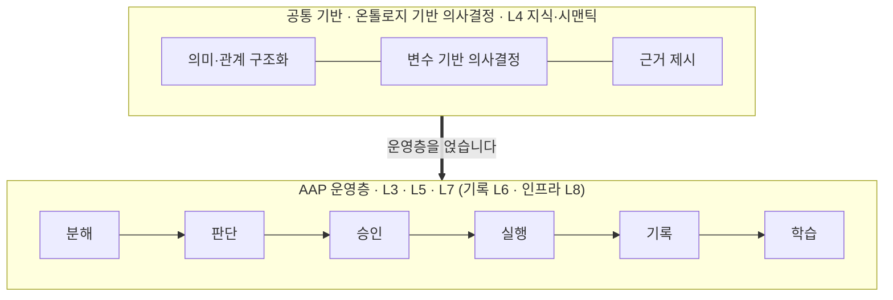
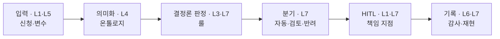

# 도식 (GitHub 렌더용)

HTML 도식 두 개(`도식_온톨로지_vs_AAP_v0_1.html`, `도식_운영층_데모_v0_1.html`)를 GitHub에서 바로 보이도록 Mermaid로 옮긴 문서입니다. 원본 HTML은 화이트·teal 디자인과 화면 목업까지 포함하지만 GitHub에서는 렌더되지 않습니다. 이 문서는 구조와 메시지만 전달합니다. 슬라이드 덱 본문은 [시각자료 내용 추출](시각자료_내용추출_검토용.md)에 표·목록으로 들어 있습니다.

---

## 1. 온톨로지는 기반, AAP는 운영층

둘은 대립이 아니라 층입니다. AAP는 온톨로지를 버리는 것이 아니라 그 위에 운영층을 얹습니다.

온톨로지 기반 의사결정(분석)과 AAP(운영)의 차이:

| 관점 | 온톨로지(분석) | AAP(운영) |
|---|---|---|
| 실행 | 분석에서 멈춤 | 시스템 반영(writeback) |
| 판단 | 분석·추론 | 결정론 판정·재현·감사 |
| 사람 | 결과 보고 판단 | HITL 게이트 내장 |
| 구성 | 지식 기반 중심 | 지식·모듈·정책·HITL 조합 |

- **온톨로지는 AAP의 약점이 아니라 L4 기반입니다.** 다만 모든 온톨로지 기술을 단독 보유한다는 뜻은 아니며, 업무·정책·시스템 맥락 설계는 kt ds가 주도하고 전문 온톨로지·KG 역량은 파트너와 조합합니다.
- 세 관점: 기술(분석 → 통제된 실행), 사업(한 번 구축 분석 자산 → 상시 운영·구독·확장), 시장(대형 중심 Decision Intelligence → 중견·준정부 빈자리).
- **특장점 한 문장**: 온톨로지 기반 의사결정이 판단 근거와 선택지를 분석하는 도구라면, AAP는 그 판단을 통제된 운영 흐름으로 전환하고 반복 실행·재현·감사가 가능하도록 기록하는 운영 플랫폼입니다.

---

## 2. 운영층 데모 (화면 도식)

변수를 바꾸면 결과가 결정론으로 다시 계산되고, 책임 지점에서 사람이 승인합니다. 실제 작동 화면이 아니라 운영 구조를 설명하는 정적 목업입니다. 시나리오는 공공·준정부 지원사업 선정 심사이며, R&D 과제 평가·인증 심사·입찰로 교체 가능합니다. 숫자는 가정값입니다.

**운영 루프와 8계층 매핑**

이 운영 루프는 8계층 캐논 Operating Loop(분해·판단·승인·실행·기록·학습)의 도메인 인스턴스이며, 별도의 루프가 아닙니다.

**화면 구성**

| 영역 | 내용 |
|---|---|
| 변수 패널(입력) | 예산 총액(가정 120억), 자격 기준(매출·업종·지역), 배점 가중치(기술·고용), 중복수급 정책(제한 ON). 변수 변경 시 결과 즉시 재계산 |
| 분기 | 선정 12(자동) / 검토 5(경계) / 반려 8 |
| 예산 소진 | 93.6억 / 120억 · 78% |
| HITL | 경계 점수 1건 승인 대기 — 자동 확정 전 사람 승인 |
| 근거 레일 | 적용 룰(RULE 7, 자격(매출) 미달 → 반려, 임계 −3%), 재현 ID(rep#A12F) |

**LLM 위치**: 책임 판정(선정·검토·반려·예산)은 결정론으로 처리해 같은 입력이면 같은 결과가 나옵니다. LLM은 설명·요약·인터페이스 보조로 붙일 수 있습니다.

**경계와 금칙**: 미래 예측 아님(구조화된 모델 안의 what-if) · 숫자·기준은 가정값(SME 검증 전) · 자동 확정 없음(책임 지점은 사람 승인).

**연계**: 결정론 엔진과 하니스 보조금 심사 자산을 재사용하고, 호르무즈 온톨로지가 의미화 자리에 들어갑니다.
